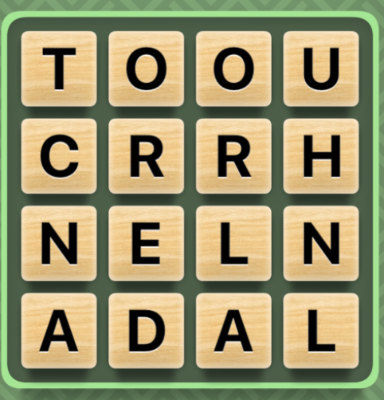
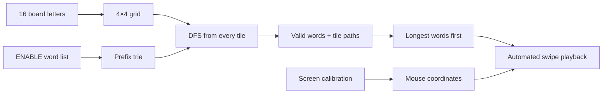

<div align="center">

# Word Hunt Bot

### A computer-vision-ready solver that finds and plays words on a 4×4 board

[](https://www.python.org/)
[](https://docs.astral.sh/uv/)
[](https://www.apple.com/macos/)

[Overview](#overview) · [How it works](#how-it-works) · [Architecture](#architecture) · [Getting started](#getting-started)



</div>

## Overview

Word Hunt Bot automates the search-and-swipe loop of a 4×4 Word Hunt-style game. Give it the 16 board letters and it will:

1. search every valid adjacent-letter path;
2. prune impossible paths with a prefix trie;
3. rank the results with longer words first; and
4. trace each word across calibrated screen coordinates.

The project combines a classic graph-search problem with desktop automation. It also includes an experimental local vision path that can convert a board screenshot into a letter grid with a Qwen3-VL model served by Ollama. The current `main.py` flow uses manual letter entry by default.

## What it demonstrates

| Capability | Implementation |
| --- | --- |
| Board search | Depth-first search explores all eight neighboring tiles without reusing a tile in one word. |
| Fast validation | A custom trie rejects branches as soon as their letter sequence is no longer a valid prefix. |
| Word prioritization | Results are sorted by descending word length, then alphabetically. |
| Screen automation | Calibrated cell coordinates are translated into click-and-drag mouse paths. |
| Board capture | The calibrated board region can be saved as an image for processing. |
| Local vision experiment | Ollama and Qwen3-VL can parse a screenshot into a 4×4 JSON letter grid. |

## How it works



For each tile, the solver walks horizontally, vertically, and diagonally through unvisited neighbors. The trie makes this practical by stopping a branch immediately when the current letters cannot begin any dictionary word. Every completed word is stored alongside the exact tile path needed to play it.

## Architecture

| File | Responsibility |
| --- | --- |
| [`main.py`](src/wordgames_bot/main.py) | Coordinates board input, solving, timing, sorting, and playback. |
| [`solver.py`](src/wordgames_bot/solver.py) | Implements board parsing, DFS search, and the optional Ollama vision experiment. |
| [`trie.py`](src/wordgames_bot/trie.py) | Loads the dictionary into a compact prefix trie for word and prefix lookup. |
| [`screen.py`](src/wordgames_bot/screen.py) | Stores calibration, captures the board, and translates paths into mouse movement. |
| [`calibration.py`](src/wordgames_bot/calibration.py) | Provides the interactive calibration entry point. |
| [`paths.py`](src/wordgames_bot/paths.py) | Centralizes paths to data, configuration, and captured images. |

### Repository layout

```text
WordGames_Bot/
├── src/wordgames_bot/  # Application package
├── data/               # Dictionary and vision prompt
├── config/             # Calibration and game configuration
├── images/             # Demo boards, captures, and crops
├── examples/           # Standalone usage examples
├── README.md            # Project overview
└── SETUP.md             # Installation and operation guide
```

## Getting started

The shortest path is:

```bash
uv sync
uv run word-hunt-calibrate
uv run word-hunt-bot
```

Calibration is machine- and window-position-specific. On macOS, the terminal or IDE running the bot also needs Accessibility permission for mouse control; screenshot capture additionally needs Screen Recording permission.

See [SETUP.md](SETUP.md) for installation, calibration, input format, optional screenshot extraction, and troubleshooting.

## Current scope

- The active game path targets a 4×4 board.
- Board letters are entered manually in the default runner at `src/wordgames_bot/main.py`.
- Playback stops after roughly 70 seconds to avoid running beyond a game round.
- Calibration data is tied to the current screen layout and must be regenerated when the board moves or resizes.
- Screenshot-to-grid extraction exists as an optional local-model experiment and is not enabled in the default runner.

## Responsible use

This project is intended as an educational exploration of tries, graph search, vision-language models, and desktop automation. Use automation only where it is permitted by the software or service you are interacting with.
